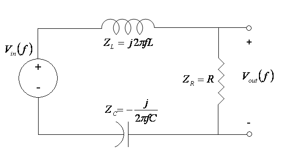

This application allows a student to interact with a simple bandpass filter that consists of a resistor, R, an inductor, L, and a capacitor, C in series.  The output voltage is taken across the resistor.  This circuit is shown in Figure 1.

Figure 1: 

The magnitude response, which is the ratio of output voltage to input voltage, is a function of the frequency of the input as well as the values of R, L and C.  The equation is as follows: 

$$\left|H(f)\right| = \frac{R}{\sqrt{R^2 + \left(2\pi fL - \frac{1}{2\pi fC}\right)^2}} $$

## Inputs:
* R:  Resistance in ohms - recommended range: 1 - 1000; default value = 1  ohm.
* L:  Inductance in milliHenries (mH) - recommended range: 0.1 - 10; default = 0.1 mH
* C:  Capacitance in microFarads (uF) - recommended range: 1 - 20; default = 10 uF.
* units: there are two options: an absolute value or logarithmic value in decibels, i.e., 20log10(absolute).
* f: Input frequency in Hertz (Hz) to at which to determine particular magnitude response values 

For the default settings, the resonant frequency is 5000 Hz.

## Outputs:
* A line plot of the magnitude response against frequency (from 1 Hz to 10000 Hz).
* A vertical green line that shifts to the input frequency chosen by the user.  
* Text box showing the resonant frequency based on the L and C values inputted by the user
* Text box showing the frequency the user had inputted
* The magnitude response at the input frequency.

## Embedded Application

<!--html_preserve--><iframe src="app4c27795504a32a83f22f8f7f569192d7/?w=&amp;__subapp__=1" width="100%" height="550" class="shiny-frame"></iframe><!--/html_preserve-->
